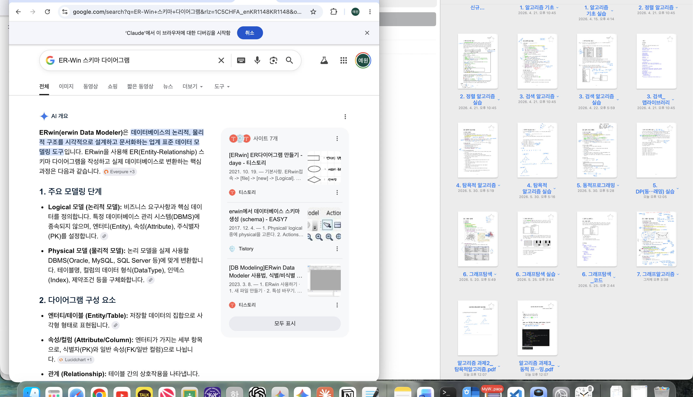
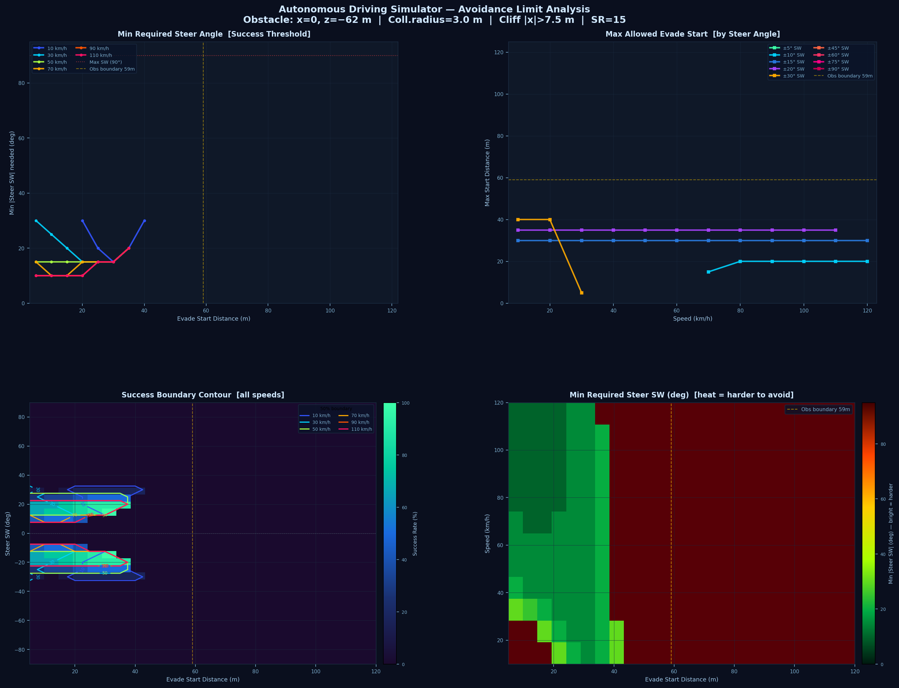

# 자율주행 긴급회피 시뮬레이터

> **기구학적 자전거 모델 + CCD + PD 제어** 기반 자율주행 충돌 회피 시뮬레이터

한신대학교 PD학기제 프로젝트 (2026-1학기)  
팀장: 이웅재 · 팀원: 임예원 · 지도교수: 박기홍 교수님

---

## 데모



브라우저에서 `index.html`을 열면 바로 실행됩니다. 별도 설치 불필요.

---

## 핵심 알고리즘

### 1. 기구학적 자전거 모델 (Kinematic Bicycle Model)
차량 운동을 세 가지 상태로 표현합니다.

```
ẋ = v · cos(θ)
ẏ = v · sin(θ)
θ̇ = (v / L) · tan(δ)

L = 2.5 m (축거)  |  δ : 바퀴 조향각  |  STEERING_RATIO = 15
```

### 2. CCD (Continuous Collision Detection)
직선-원 교차 판정으로 매 프레임 충돌을 검사합니다.

```
판별식 Δ = b² - 4ac ≥ 0  →  충돌
충돌 반경 3.0 m  (차량 1.5 m + 장애물 1.5 m)
```

### 3. 4단계 상태 기계 (FSM)

```
STRAIGHT → EVADE → PD_RETURN → LANE_RETURN → COMPLETE
```

### 4. PD 제어기 (복귀 제어)

```
errDeg  = (θ − TARGET_THETA) × 180/π
steer   = −Kp·errDeg − Kd·(Δerr/Δt)

Kp = 0.50  |  Kd = 0.05  |  기준 속도 VREF = 60 km/h
```

### 5. 가변 전방 주시 거리 (Look-Ahead)

```
L_lookahead = 0.2 × v   (v : km/h)
```

---

## 파일 구조

```
├── index.html                  # 메인 시뮬레이터 (Three.js, 1,500+ lines)
│
├── avoidance_dataset.py        # 헤드리스 시뮬레이션 · 데이터셋 생성 (10,656회)
├── avoidance_scatter_plot.py   # 회피 성공/실패 산포도 시각화
├── avoidance_scatter_1m.py     # 1m 해상도 산포도
├── avoidance_limits_plot.py    # 속도×조향각별 성능 한계 곡선
│
├── avoidance_dataset.csv       # 전체 시뮬레이션 결과 (10,656행)
├── avoidance_1m_cache.csv      # 1m 해상도 캐시
├── avoidance_limits.csv        # 한계 좌표 데이터
│
├── avoidance_report.txt        # 분석 요약 리포트
├── avoidance_plots.png         # 분석 그래프 종합
├── avoidance_scatter.png       # 성공/충돌/낭떠러지 산포도
├── avoidance_scatter_1m.png    # 1m 해상도 산포도
├── avoidance_scatter_5m.png    # 5m 해상도 산포도
├── avoidance_limits.png        # 속도별 한계 곡선
│
└── figures/                    # 보고서용 다이어그램
    ├── II-1_bicycle_model.png
    ├── II-2_block_diagram.png
    ├── II-3_topview.png
    ├── II-4_fsm.png
    ├── III-2_ccd.png
    ├── IV-1_avoidance_scatter.png
    ├── IV-2_rear_collision.png
    ├── V-1_pd_block.png
    ├── V-2_stanley_diverge.png
    ├── V-3_lookahead.png
    ├── VI-1_follow.png
    ├── VI-1_full_ui.jpg
    ├── VI-1_simulator_full.png
    ├── VII-1_VII-2_limits.png
    └── VIII-2_future_work.png
```

---

## 실행 방법

### 시뮬레이터 (index.html)
```
index.html을 Chrome / Firefox / Edge 등 모던 브라우저에서 열기
(로컬 파일 실행 지원 — 서버 불필요)
```

### 데이터셋 생성 (Python)
```bash
pip install pandas numpy openpyxl matplotlib
python avoidance_dataset.py        # 10,656회 헤드리스 시뮬레이션
python avoidance_scatter_plot.py   # 산포도 생성
python avoidance_limits_plot.py    # 한계 곡선 생성
```

---

## 실험 결과 요약

파라미터 공간: 핸들 조향각 −90°∼+90°(37단계) × 기동 시작점 5∼120m(24단계) × 속도 10∼120 km/h(12단계) = **10,656회**

| 결과 | 건수 | 비율 |
|------|------|------|
| 성공 (SUCCESS) | 390 | 3.7% |
| 충돌 (COLLISION) | 7,490 | 70.3% |
| 낭떠러지 이탈 (CLIFF) | 2,776 | 26.1% |

**최적 조향각**: ±20° SW (바퀴 ±1.3°) → 성공률 23.6%



---

## 기술 스택

| 구분 | 기술 |
|------|------|
| 3D 렌더링 | Three.js r160 (CDN) |
| 물리 시뮬레이션 | Vanilla JavaScript |
| 데이터 분석 | Python 3, pandas, matplotlib |
| 실행 환경 | 브라우저 (Chrome 권장) |

---

## 향후 연구 방향 (2026-2학기)

- 날씨별 Gaussian 노이즈 모델 (비·눈·안개·야간) 추가
- Kalman Filter 기반 실시간 위치 추정 모듈 구현
- Three.js 가상 카메라 + OpenCV 영상처리 장애물 감지 파이프라인
- 4종 기상 조건별 긴급회피 성능 한계 데이터셋 도출

---

*한신대학교 AISW학부 · 컴퓨터공학과 | 2026*
